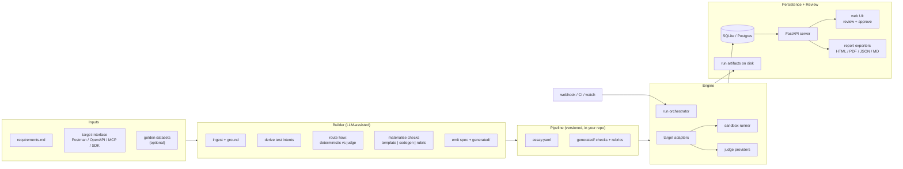
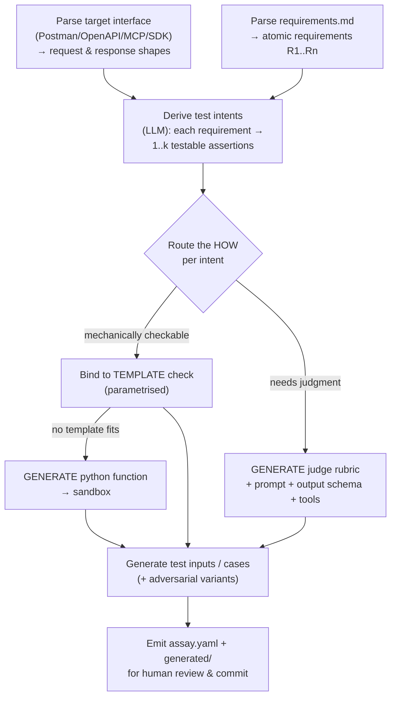
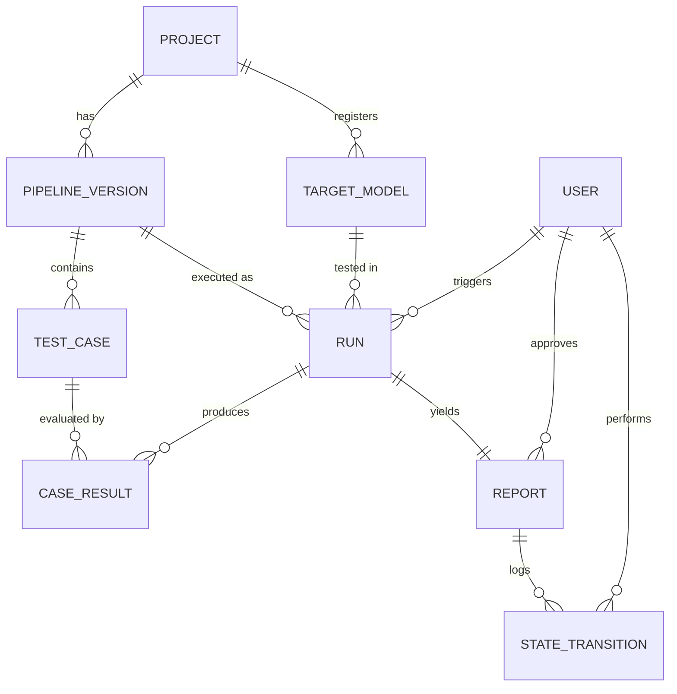
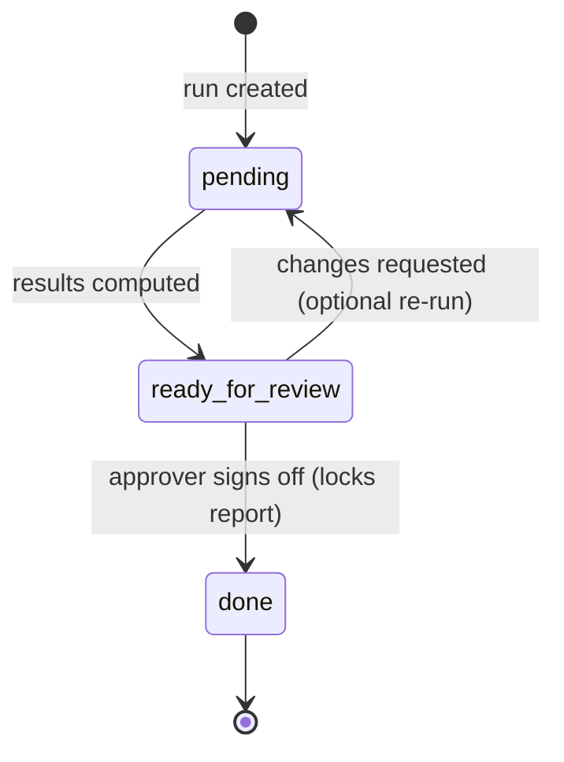

# Assay — an open-source eval-pipeline *builder*

> Working name. `assay` reads well as a CLI verb (`assay run`) and means "a test of composition/quality." Swap freely.

Assay is the eval layer the compliance-copilot was missing, generalised into a product for anyone building or integrating models into an app. You point it at a deployed model (endpoint, MCP, or SDK), hand it your assessment requirements, and it **builds an eval pipeline for you**: it decides *what* to test, routes each test to the right *how* (deterministic code vs. LLM judge), generates the checks and rubrics, runs them, and produces a saved, reviewable, sign-off-gated report.

The design rests on three load-bearing decisions you made:

1. **Audience = builders/integrators.** They live in repos and CI. So the core is eval-as-code (a versioned spec + committed generated functions) with a thin web UI bolted on for the review/approval workflow that the hard requirements demand. Not a SaaS, not a notebook.
2. **Generated deterministic functions are a first-class feature**, run inside a contained Python sandbox — not a flagged escape hatch.
3. **Self-hosted, single binary-ish footprint.** Runs on a laptop with SQLite; `docker compose up` to deploy somewhere the team can reach it (then Postgres). Automation can *trigger* runs but can never *self-promote* a report to production — a human with reviewer authority always does that.

---

## 1. The core mental model

Three nouns, in order:

- **Requirements** — what "good" means, in your words (`requirements.md`). The source of truth.
- **Pipeline (the spec)** — the compiled, version-controlled translation of those requirements into concrete test cases + checks (`assay.yaml` + `generated/`). This is the artifact Assay *builds*.
- **Run → Report** — one execution of a pipeline version against one snapshot of a target model, plus the reviewable, sign-off-gated result.

The product's job is the arrow **Requirements → Pipeline** (the "builder" part, LLM-assisted), then **Pipeline → Run → Report** (the "runner" part, deterministic and auditable).

A principle that makes everything else tractable:

> **A check is a pure function `(response, context) → result`. It never performs I/O, never calls the target, never touches the network.**

The trusted adapter layer fetches the model response. The (possibly LLM-generated, possibly untrusted) check code only ever sees already-captured *data*. That separation is what makes the sandbox simple to reason about and what makes runs reproducible.

---

## 2. System architecture



Layered responsibilities:

| Layer | Responsibility | Trust |
|---|---|---|
| **Adapters** | Reach the target-under-test and the judge models; normalise requests/responses | Trusted |
| **Builder/Generator** | Requirements → intents → checks; the LLM-assisted authoring | Trusted (produces artifacts a human reviews) |
| **Checks** | Vetted template library + generated functions | Templates trusted; generated = untrusted → sandboxed |
| **Sandbox** | Isolated execution of generated functions on captured data | Containment boundary |
| **Engine** | Orchestrate a run, collect results, compute gating | Trusted |
| **Store** | Persist runs/reports/targets/identities/audit | Trusted |
| **Server + UI** | Trigger, review, approve, export | Auth + RBAC boundary |

---

## 3. Form factor & distribution

Two surfaces over one engine, because builders want both eval-as-code *and* a human review workflow:

- **`assay` CLI / Python library** — the engine. Installs with `pipx install assay` or zero-install `uvx assay …`. This is what runs in CI and what a solo dev uses end-to-end.
- **`assay serve` web app** — FastAPI + a thin Next.js front-end. The review queue, report viewer, approval gate, target registry, and webhook receiver. Optional for a solo user; required for the team-review story.

Deploy paths, easiest first:

```bash
# Solo, local, zero infra
uvx assay init && uvx assay generate ... && uvx assay run && uvx assay serve

# Team, self-hosted
docker compose up        # bundles server + UI + Postgres + a worker
```

SQLite is the default store (file under `.assay/`). Set `ASSAY_DB_URL=postgres://…` and it switches with no code change — same migrations.

---

## 4. The build flow (Requirements → Pipeline)

This is the heart of the product. `assay generate --requirements requirements.md --target target.postman_collection.json`.



Step detail:

1. **Ground on the interface.** A Postman collection or OpenAPI spec gives request templates, auth, variables, and response schemas; an MCP descriptor gives tool schemas; an SDK config gives the call signature. The generator knows the *shape* it's testing against, so generated checks reference real fields (`$.findings[*].article`) instead of guessing.
2. **Derive intents.** The LLM decomposes each requirement into discrete assertions and tags each with a category (correctness, safety/refusal, format, latency, cost, robustness, tone…). Intents are written back with a `requirement_ref` so you keep a **requirement-coverage matrix**: every requirement traces to ≥1 test and every test traces to a requirement.
3. **Route deterministic vs. stochastic.** Default heuristic: if the assertion can be decided by parsing the response (schema valid? field present? number in range? latency < N? refusal pattern? PII absent? citation resolves?), it's deterministic. If it needs semantic judgment (is the regulatory reasoning sound? is the refusal appropriately justified? is severity calibrated?), it's an LLM judge. The LLM *proposes* the route with a rationale; you can override per-intent in the spec or UI.
4. **Materialise.**
   - **Template** — bind to a vetted primitive (§6) with parameters. Preferred; fully trusted, fast, deterministic.
   - **Generated function** — when no template fits, the LLM writes a pure Python check (§6.2) committed to `generated/checks/`. This is the core differentiator.
   - **Judge rubric** — the LLM writes an anchored rubric, judge prompt, structured-output schema, and any judge tools, to `generated/rubrics/`.
5. **Generate cases.** Concrete inputs per intent, optionally with adversarial/edge variants, or bound to a golden dataset you provide.
6. **Emit & review.** Everything lands as diffable files. Nothing reaches "production" until a human has read the generated code/rubrics and a reviewer signs off the first report.

---

## 5. Target & judge adapters

One small interface; built-in implementations cover the cases you named.

```python
# adapters/base.py
from dataclasses import dataclass
from typing import Protocol, runtime_checkable

@dataclass
class ModelRequest:
    input: dict        # normalised: {messages|prompt|http_body}
    params: dict       # temperature, max_tokens, seed, tools, ...
    metadata: dict

@dataclass
class ModelResponse:
    text: str | None
    raw: dict          # full provider/HTTP payload (always captured)
    tool_calls: list | None
    latency_ms: float
    usage: dict        # token counts
    cost_usd: float | None
    status: str        # ok | error | timeout
    error: str | None

@runtime_checkable
class TargetAdapter(Protocol):
    name: str
    def describe(self) -> dict: ...               # capabilities derived from interface
    def invoke(self, req: ModelRequest) -> ModelResponse: ...

@runtime_checkable
class JudgeProvider(Protocol):
    name: str
    def complete(self, messages: list, *, schema: dict | None,
                 tools: list | None, params: dict) -> ModelResponse: ...
```

**Initial target adapters** (the model *under test*):

| Adapter | Covers | Notes |
|---|---|---|
| `openai_compat` | OpenAI, vLLM, LM Studio, OpenRouter, most local servers | Chat Completions shape |
| `anthropic` | Claude (Messages API) | |
| `ollama` | Local Ollama | native API |
| `rest` | **Arbitrary products** (e.g. compliance-copilot) | imports **Postman collection** or **OpenAPI**, templated request, var substitution, auth |
| `mcp` | MCP servers / agents | lists & calls tools, sampling |
| `custom` | Anything | user implements the `TargetAdapter` Protocol; one file |

**Judge/runner providers** (the LLM doing the grading): `anthropic`, `openai`, `ollama`, `openai_compat`, `custom`. Provider creds come from env vars referenced in the spec, never inline.

The compliance-copilot case you described maps directly to `rest` + a Postman import: Assay reads the collection, picks the "analyze feature" request, substitutes `{{base_url}}`/auth, sends each test input, and captures the full JSON finding as `raw`.

---

## 6. Checks: templates, generated functions, judges

### 6.1 Template library (vetted, trusted)

Pure functions shipped with the tool, parametrised by the spec. Initial set:

`json_schema` · `regex_match` · `contains` / `not_contains` · `equals` · `numeric_bound` (min/max on an extracted value) · `latency_bound` · `cost_bound` · `refusal_detector` · `pii_absent` · `citation_present` · `citation_resolves` (does the cited reference exist) · `valid_json` · `field_present` (JSONPath) · `enum_value` · `length_bound`.

Common contract:

```python
# checks/base.py
@dataclass
class CheckResult:
    check_id: str
    passed: bool
    score: float | None        # 0..1 for graded checks; None for pass/fail
    severity: str              # info | warn | fail
    message: str
    evidence: dict             # the slice of the response that decided it

class Check(Protocol):
    def __call__(self, response: ModelResponse, context: dict) -> CheckResult: ...
```

### 6.2 Generated functions (the core feature, sandboxed)

When no template fits, the builder writes a check to `generated/checks/<name>.py`. Hard contract the generator must satisfy:

```python
# generated/checks/severity_monotonic.py  (LLM-authored, human-reviewed, committed)
def check(response: dict, context: dict) -> dict:
    """Findings flagged 'blocked' must carry severity >= those flagged 'shippable'."""
    findings = response["json"].get("findings", [])
    rank = {"shippable": 0, "mitigate": 1, "blocked": 2}
    sev  = {"low": 0, "medium": 1, "high": 2, "critical": 3}
    bad = [f for f in findings
           if rank.get(f.get("status")) == 2 and sev.get(f.get("severity"), 0) < 2]
    return {
        "passed": not bad,
        "score": None,
        "severity": "fail" if bad else "info",
        "message": f"{len(bad)} blocked findings with sub-high severity" if bad else "ok",
        "evidence": {"violations": bad[:5]},
    }
```

Note what the function gets: **plain dicts only** — the already-captured response and a read-only context. No clients, no network, no filesystem.

**Sandbox guarantees** (`sandbox/runner.py`):

- runs in a **separate subprocess**, not the engine process;
- **no network** (deny-all egress; the function has nothing to call anyway);
- **CPU/memory/wall-clock limits** via `resource` rlimits + hard timeout;
- **import allowlist** (`json`, `re`, `math`, `datetime`, `jsonschema`…); imports outside it raise;
- **filesystem isolation** to a throwaway temp dir; no access to the host repo or `.assay/`;
- inside Docker, this sits within the already-isolated container boundary as a second layer.

Because generated code is committed and diffable, it's auditable, and because it's pure-on-data, a failed/exploited check can corrupt *one result*, not your machine or your model.

### 6.3 LLM judges (stochastic)

For semantic assertions. Generated rubric is anchored and forces structured evidence:

```yaml
# generated/rubrics/reg_reasoning.yaml
judge: primary
dimensions:
  - id: article_correctness
    question: "Does each finding cite an article that actually governs the described feature?"
    scale: {0: "cites wrong/irrelevant article", 1: "partially correct", 2: "correct & specific"}
  - id: uncertainty_flagging
    question: "When the feature is ambiguous, does it flag uncertainty rather than assert compliance?"
    scale: {0: "asserts confidently", 1: "weakly hedged", 2: "explicitly flags + asks"}
output_schema: { type: object, required: [scores, rationale, evidence_quotes] }
require_evidence: true        # judge must quote spans from the response
```

Judge hygiene baked in: temperature 0, structured output (tool/JSON schema), mandatory rationale + quoted evidence, optional self-consistency (n>1, majority/median), and bias guards (randomise option order for pairwise; cap verbosity bias). Known judge limitations are surfaced in the report rather than hidden.

---

## 7. Data model

Everything the hard requirements demand is a first-class, queryable record.



Key tables and the requirement each satisfies:

- **PROJECT** — a pipeline/model under evaluation.
- **PIPELINE_VERSION** — immutable snapshot: spec hash + hash of all `generated/` files + git commit. *(reproducibility; "test cases and key details recorded")*
- **TARGET_MODEL** — snapshot of the thing tested: adapter, provider, model id, endpoint, params, prompt/version, interface-file hash, captured at run time. *(req: "tested model and its details must be recorded")*
- **TEST_CASE** — input, expectations, the resolved "how" (template/generated/judge), and `requirement_ref`. *(req: "test cases … recorded"; traceability)*
- **RUN** — which pipeline version × which target snapshot, trigger type (`manual|auto|ci`), triggered_by, env, started/finished, status, total cost. *(audit)*
- **CASE_RESULT** — per case per run: full request, **full raw response**, every CheckResult, judge rationale+evidence, latency, tokens, cost, pass/fail/score. *(req: "all other key details recorded"; reproducibility)*
- **REPORT** — derived from a run; holds `state`, `approved_by`, `approved_at`, exported file paths, locked flag. *(req: states + approver)*
- **USER** — identity + role (`runner | reviewer | admin`). *(req: an authorised reviewer)*
- **STATE_TRANSITION** — append-only audit log of who moved a report between states and when. *(req: approver + accountability)*

---

## 8. Reports: states, triggers, and the approval gate

### State machine



- **pending** — run is queued/executing, or finished but not yet submitted for review.
- **ready_for_review** — all results computed; awaiting an authorised reviewer.
- **done** — a user with reviewer authority has approved; report is **locked**, `approved_by` + `approved_at` stamped, immutable thereafter. This is the "ready for production" gate.

The optional `ready_for_review → pending` back-edge ("changes requested") is the only place I've extended your three states — flag it if you'd rather keep the graph strictly forward-only.

### Triggers (who/what starts a run)

- **Manual** — `assay run` (CLI/CI) or the UI "Run" button. Any user may trigger.
- **Automatic on update** — `POST /hooks/run` (a webhook fired by your deploy/CI when the model or prompt changes), the GitHub Action, or `assay watch`.

**Invariant: automation can reach `ready_for_review` but never `done`.** Only a `reviewer`/`admin` can move a report to `done`. A bot deploy can't self-approve itself into production — that's the human authority you required, enforced in `auth.py` + the state-transition handler.

### Export

`done` (or any state) can export to **HTML / PDF / JSON / Markdown**. The report embeds: target snapshot, pipeline version + commit, per-requirement coverage matrix, per-case results with evidence, judge rationales, cost/latency rollups, and the approval block (who, when, state history). Files are saved under `.assay/reports/<run_id>/` and registered on the REPORT row.

---

## 9. Repo layout

### The product (the tool itself)

```
assay/
  pyproject.toml
  README.md
  docker-compose.yml            # server + ui + postgres + worker
  assay/
    cli.py                      # typer entrypoint: init/generate/run/serve/watch/export
    config.py
    spec/        models.py loader.py validate.py
    adapters/    base.py openai_compat.py anthropic.py ollama.py rest.py mcp.py custom.py registry.py
    checks/      base.py registry.py
                 library/ schema.py regex.py numeric.py latency.py refusal.py pii.py citation.py ...
    generator/   ingest.py intents.py router.py codegen.py rubricgen.py casegen.py emit.py
    sandbox/     runner.py policy.py
    judges/      base.py rubric.py run_judge.py
    engine/      runner.py scheduler.py gating.py
    store/       db.py models.py migrations/
    reporting/   report.py coverage.py exporters/ html.py pdf.py json.py md.py
    server/      app.py auth.py api/ runs.py reports.py review.py targets.py hooks.py
    web/         (thin Next.js: review queue, report viewer, approve button, target registry)
  examples/
    compliance-copilot/         # flagship worked example
      requirements.md  assay.yaml  target.postman_collection.json
      generated/  datasets/
  tests/
```

### A user's eval directory (what Assay generates / they commit)

```
my-model-evals/
  requirements.md                  # input: what "good" means
  target.postman_collection.json   # or openapi.yaml / mcp.json / sdk config
  assay.yaml                       # the compiled pipeline (reviewed)
  generated/
    checks/    *.py                # generated deterministic functions (reviewed, committed)
    rubrics/   *.yaml              # generated judge rubrics
  datasets/    *.jsonl             # golden inputs (optional)
  .assay/                          # local state: sqlite db, run artifacts, reports  (gitignored)
```

---

## 10. Spec example (compliance-copilot)

```yaml
version: 1
project: compliance-copilot
target:
  adapter: rest
  import: target.postman_collection.json
  request: "Analyze Feature"
  variables: { base_url: "http://localhost:8000" }
  auth: { type: bearer, token_env: COPILOT_TOKEN }
judges:
  primary: { provider: anthropic, model: claude-opus-4-8, params: { temperature: 0 } }
suites:
  - id: regulatory-correctness
    requirement_ref: requirements.md#R1
    cases:
      - id: R1-unsupported-claim
        input: { feature_description: "Swap any ERC-20, zero KYC, up to €50k." }
        checks:
          - { type: template, uses: valid_json }
          - { type: template, uses: json_schema, with: { schema_ref: schemas/finding.json } }
          - { type: template, uses: citation_present, with: { field: "$.findings[*].article", min: 1 } }
          - { type: generated, uses: generated/checks/severity_monotonic.py }
          - { type: judge, judge: primary, rubric: generated/rubrics/reg_reasoning.yaml }
        gate: all_required
  - id: latency
    requirement_ref: requirements.md#R7
    cases:
      - id: R7-p95
        input: { feature_description: "Standard EUR on-ramp with tiered KYC." }
        checks: [ { type: template, uses: latency_bound, with: { max_ms: 5000 } } ]
gating:
  fail_run_if: "any required check fails"
  regression_against: last_done   # compare to last approved run; flag regressions
```

---

## 11. Quickstart (what the README's first screen says)

```bash
# 1. install (zero-install also works: uvx assay ...)
pipx install assay

# 2. scaffold
assay init my-model-evals && cd my-model-evals
#    -> writes requirements.md stub + .assay/

# 3. describe what "good" means in requirements.md, drop in your interface file,
#    then let Assay build the pipeline
assay generate \
  --requirements requirements.md \
  --target target.postman_collection.json \
  --judge anthropic:claude-opus-4-8
#    -> writes assay.yaml + generated/checks + generated/rubrics

# 4. REVIEW the generated code & rubrics in your editor, commit them

# 5. run it
assay run                      # executes, sandboxes generated checks, stores a Report (pending)

# 6. review & approve
assay serve                    # open the UI: triage -> ready_for_review -> approve -> done
#    (or `docker compose up` to host it for the team)

# 7. export
assay export <run_id> --format pdf
```

CI (auto-trigger on model/prompt change):

```yaml
# .github/workflows/eval.yml
on: { push: { paths: ["prompts/**", "model.config.*"] } }
jobs:
  eval:
    runs-on: ubuntu-latest
    steps:
      - uses: actions/checkout@v4
      - run: pipx install assay && assay run --notify ${{ secrets.ASSAY_WEBHOOK }}
      # lands as ready_for_review; a human still approves to done
```

---

## 12. Eval & engineering best practices the design enforces

- **Eval-as-code.** Spec + generated functions are diffable, reviewable, version-pinned to a commit.
- **Requirement traceability.** Every test references a requirement; the report shows a coverage matrix both ways (uncovered requirements *and* orphan tests are visible).
- **Reproducibility.** Full request/response, params, seeds, model + interface hashes, and costs are captured per case; a run is replayable.
- **Purity → safety + determinism.** Checks see data only; the network/I/O boundary lives in trusted adapters.
- **Regression tracking.** Each run can compare to the last `done` run and flag deltas, so "we got worse" is loud.
- **Judge discipline.** Anchored rubrics, structured evidence, temperature 0, optional self-consistency, surfaced limitations.
- **Human authority is structural, not advisory.** Automation triggers; only an authorised reviewer promotes to production; every transition is logged.
- **Boring to start.** `pipx install` → `init` → `generate` → `run`. SQLite, no services, no accounts for the solo path.

---

## 13. Open design decisions worth your call

1. **Report back-edge:** keep strict `pending → ready_for_review → done`, or allow the optional "changes requested" return I drew?
2. **Sandbox strength vs. setup cost:** subprocess + rlimits + import allowlist is enough for "data-only pure functions" and keeps install friction near zero. A stricter option (gVisor/Firecracker/WASM via Pyodide) raises safety but adds setup. My default is the lightweight one given your audience; say if you want the hardened tier as an opt-in.
3. **Dataset-first vs. generated-cases-first:** default generates cases from requirements, but many teams have golden sets. I have both; which is the primary documented path?
4. **Naming.** `assay` is a placeholder — happy to bikeshed.

---

### Next steps I can take on your word

- Scaffold the actual repo (pyproject, CLI skeleton, adapter Protocols, check base classes, SQLAlchemy models, FastAPI routes) as runnable code.
- Build out the **compliance-copilot example** end to end so the repo ships with a working `assay generate → run → report`.
- Write the generator prompts (intent derivation, route decision, codegen, rubric gen) as a separate spec.
